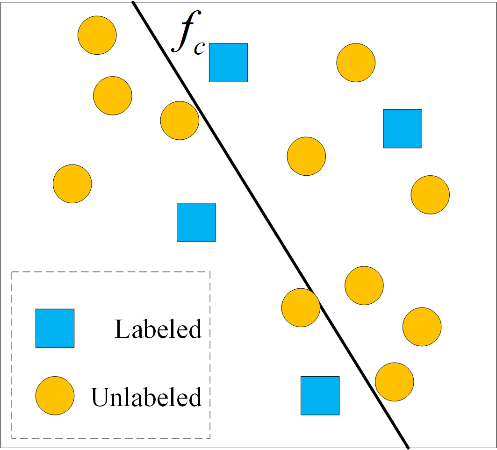
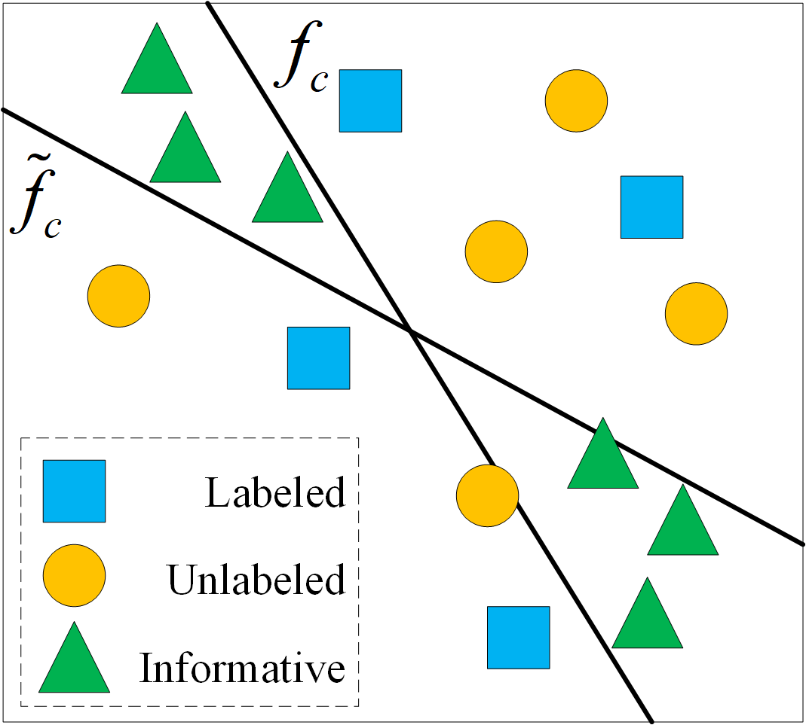
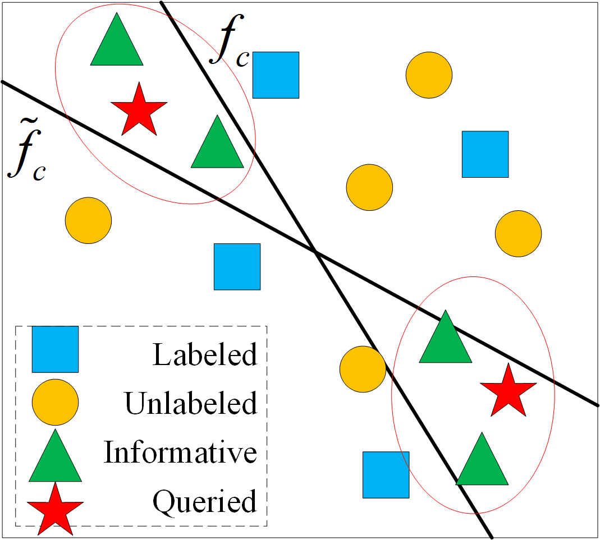

# BETA-main

PyTorch implementation of perturBed wEight acTive leArning (BETA).

  
  
  

The code includes the implementations of all the baselines presented in the paper. Parts of the code are borrowed from https://github.com/AminParvaneh/alpha_mix_active_learning.

## Setup
The dependencies are in requirements.txt. Python=3.8 is recommended for the installation of the environment.

## Datasets
It is recommended to download the following datasets from the official website and place them in the "BETA-main/data/" directory:
- MNIST: https://yann.lecun.com.
- IMDB: https://developer.imdb.com.
- BACE: https://moleculenet.org.

## Training
For WPAL training, use the following script:

- `python main.py`

## Citing

...
