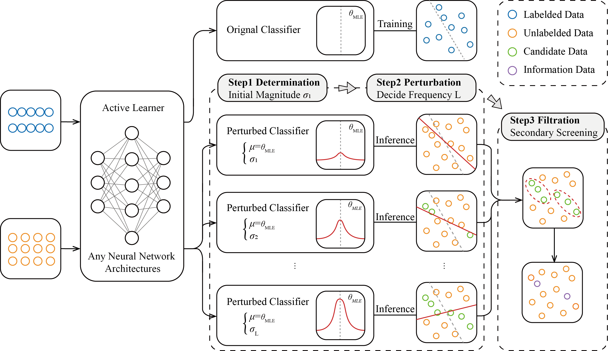

# BETA-main

PyTorch implementation of "BETA: An Epistemic-based Active Learning Strategy for Grid, Sequence, and Graph Classification".

  

Parts of the code are borrowed from https://github.com/AminParvaneh/alpha_mix_active_learning.

## Setup
The dependencies are in requirements.txt. Python=3.8 is recommended for the installation of the environment.

## Dataset
It is recommended to download the following datasets from the official website:
- MNIST: https://yann.lecun.com.
- IMDB: https://developer.imdb.com.
- BACE: https://moleculenet.org.
, and place them in the "BETA-main/data/" directory.

## Weights
The pretrained weights of ViT can be download from:
https://github.com/rwightman/pytorch-image-models/blob/master/timm/models/vision_transformer.py
, and place them in the "BETA-main/weights/" directory.

## Training
For training and evaluation, use the following script:

- `python main.py`
